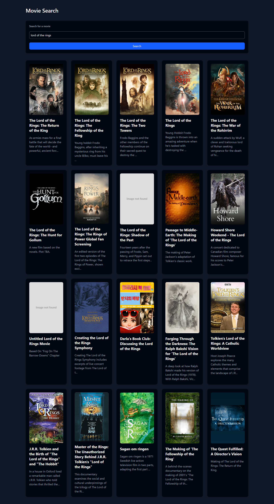

# Movie Search Page

React challange from the [react practice calendar](https://reactpractice.dev/)
You can see the challenge [here](https://reactpractice.dev/exercise/create-a-movie-search-page/?utm_source=calendar.reactpractice.dev&utm_medium=social&utm_campaign=calendar-v1)

Rename the `.env.example` to `.env` and replace the field `VITE_TMDB_ACCESS_TOKEN` with your actual token that you would get from the [TMDB API site](https://www.themoviedb.org/settings/api)

